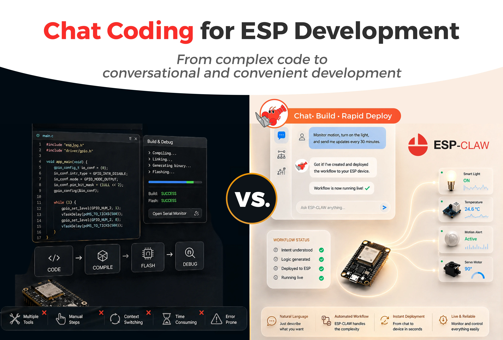
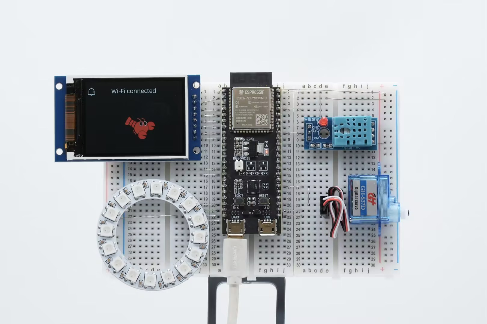
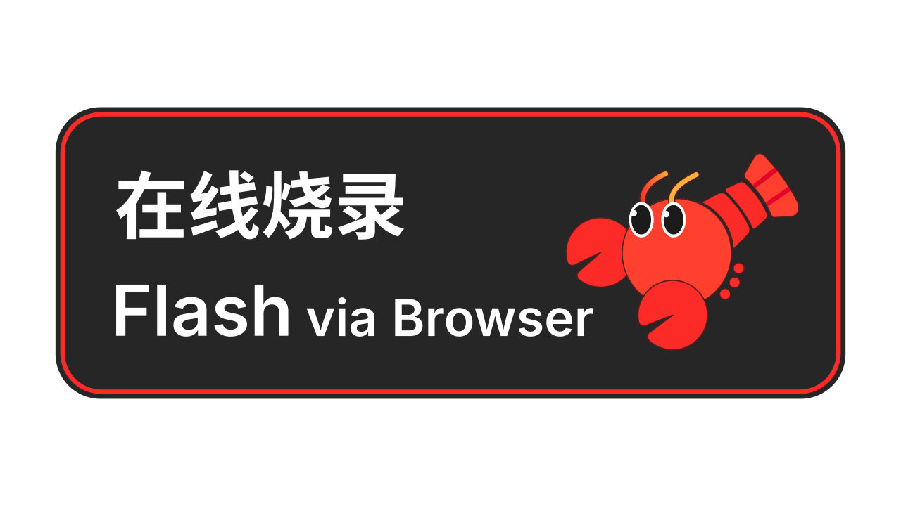
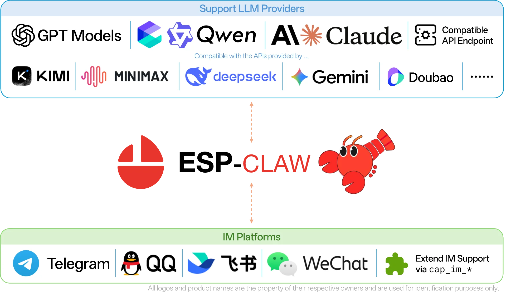

  <a href="https://vertex-agent.com/">
    <picture>
      <source media="(prefers-color-scheme: dark)" srcset="./docs/src/assets/logos/logo-f.svg" />
      <source media="(prefers-color-scheme: light)" srcset="./docs/src/assets/logos/logo.svg" />
      
    </picture>
  </a>

  <h1>Vertex-Agent 🦞 物联网设备 AI 智能体框架</h1>

  <h3>💬聊天即造物 · 🚀毫秒级响应 · 🧩智能可扩展 · 😋越用越懂你</h3>

  

    
  

  <a href="https://vertex-agent.com/zh-cn/">主页</a>
  |
  <a href="https://vertex-agent.com/zh-cn/tutorial/">文档</a>
  |
  <a href="https://vertex-agent.com/zh-cn/flash/">在线烧录</a>
  |
  <a href="https://vertex-agent.com/zh-cn/reference-project/build-from-source/">源码编译</a>
  |
  <a href="./README.md">English</a>

**Vertex-Agent** 是乐鑫推出的面向物联网设备的 **Chat Coding「聊天造物」** 式 AI Agent 框架，以对话定义设备行为，在乐鑫芯片上本地完成感知、决策与执行的完整闭环。Vertex-Agent 自 OpenClaw 理念出发，用 C 语言重新实现，轻盈、智能、成长。仅需一块几美元的 ESP32 系列芯片，便可体验 Vertex-Agent 的轻灵特性。

  

## 🌟核心特性

传统 IoT 只停留在连接层——设备能联网，却不能思考；能执行，却不能决策。Vertex-Agent 将 Agent Runtime 下沉至乐鑫芯片，让芯片从被动的"执行端"转变为主动的"决策中心"。

<table align="center">
  <tr>
    <th>
 💬 聊天造物 
</th>
    <th>
 ⚙️ 事件驱动 
</th>
  </tr>
  <tr>
    <th>
      

        IM 聊天 + Lua 动态加载
         
        普通用户即可定义设备行为，无需编程
      

    </th>
    <th>
      

        任意事件可触发 Agent Loop 等动作
         
        最快毫秒级响应
      

    </th>
  </tr>
  <tr>
    <th width="45%">
      <video src="https://github.com/user-attachments/assets/9ec020c2-d133-4ab5-adaa-28817415bc26" />
    </th>
    <th width="45%">
      <video src="https://github.com/user-attachments/assets/c3613e52-61a8-49c2-a224-4a436a4c9e3e" />
    </th>
  </tr>

  <tr>
    <td colspan="2"><!-- 分隔行 --></td>
  </tr>

  <tr>
    <th>
 🧬 结构化记忆 
</th>
    <th>
 📤 MCP 通讯 
</th>
  </tr>
  <tr>
    <th>
      

        有条理地沉淀记忆内容
         
        隐私不上云
      

    </th>
    <th>
      

        支持连接标准 MCP 设备
         
        具备 Server/Client 双重身份
      

    </th>
  </tr>
  <tr>
    <th width="45%">
      <video src="https://github.com/user-attachments/assets/1fe6d67c-469d-405d-a6ec-648aa2681b15" />
    </th>
    <th width="45%">
      <video src="https://github.com/user-attachments/assets/b582ac5b-dd14-486f-b531-495597aa2af6" />
    </th>
  </tr>

  <tr>
    <td colspan="2"><!-- 分隔行 --></td>
  </tr>

  <tr>
    <th>
 🧰 开箱即用 
</th>
    <th>
 🧩 组件扩展 
</th>
  </tr>
  <tr>
    <th>
      

        基于 Board Manager 快速配置
         
        支持一键烧录
      

    </th>
    <th>
      

        所有模块均可按需裁剪
         
        也可自行添加组件适配
      

    </th>
  </tr>
</table>

## 📦快速开始

  

Vertex-Agent 目前已适配基于 ESP32-S3、ESP32-P4、ESP32-C5、ESP32-S31 的多款开发版，例如面包板、M5Stack CoreS3 等。[已支持的开发版](./application/edge_agent/boards/)可以直接在线烧录：通过网页即可完成配置与烧录，无需额外编译固件或安装开发环境。

  

你也可以在本地编译 Vertex-Agent。请参考[本地编译文档](https://vertex-agent.com/zh-cn/tutorial/)适配、编译和烧录。未列于上述列表的开发版、ESP32-P4 等芯片还可通过本地编译烧录实现。

我们的[文档](https://vertex-agent.com/zh-cn/tutorial/)中有可供参考的使用样例。

### 支持的平台

  <picture>
    <source media="(prefers-color-scheme: dark)" srcset="./docs/static/claw-providers-white.webp" />
    <source media="(prefers-color-scheme: light)" srcset="./docs/static/claw-providers-black.webp" />
    
  </picture>

**LLM**: Vertex-Agent 现已支持 OpenAI 风格 API 和 Anthropic 风格 API，原生支持 OpenAI 提供的 GPT 系列模型、阿里云百炼提供的 Qwen 系列模型、Anthropic 提供的 Claude 系列模型、DeepSeek 官方 API 提供的 DeepSeek 模型等，也可以自定义 Endpoint。

> [!TIP]
>
> Vertex-Agent 的自编程能力需要调用工具和遵循指令能力较强的模型，推荐使用 `gpt-5.4`、`qwen3.6-plus`、`claude4.6-sonnet`、`deepseek-v4-pro` 或类似性能的模型。

**IM**: Vertex-Agent 支持 Telegram、QQ、飞书、微信四大聊天软件，并可扩展。

## 🔧开发计划

Vertex-Agent 目前仍处于活跃开发阶段，欢迎向我们提交 Issue 反馈问题或提交 Feature 请求。也可以通过[在线问卷](https://fcn5wbhnyubf.feishu.cn/share/base/form/shrcndYcjbGFY1ymttTSyYoGIPh)告诉我们你的想法。

[点此查看我们的 TODO List](https://fcn5wbhnyubf.feishu.cn/wiki/SRlgwWUYei4WmykU8uMcUtzTnFf?table=tblWSgzWcyW7jv7B&view=vewaP9B0KX)，为你心仪的 Feature / 关注的 Issue 投票，我们可以更早实现/修复！

## 📷关注我们

如果这个项目对您有所帮助，欢迎点亮一颗星！⭐⭐⭐⭐⭐

### Star History

  <a href="https://www.star-history.com/?repos=espressif%2Fvertex-agent&type=date&legend=top-left">
    <picture>
      <source media="(prefers-color-scheme: dark)" srcset="https://api.star-history.com/chart?repos=espressif/vertex-agent&type=date&theme=dark&legend=top-left" />
      <source media="(prefers-color-scheme: light)" srcset="https://api.star-history.com/chart?repos=espressif/vertex-agent&type=date&legend=top-left" />
      
    </picture>
  </a>

## 致谢

灵感来自 [OpenClaw](https://github.com/openclaw/openclaw)。

Agent Loop 和 IM 通讯等功能在 ESP32 上的实现参考了 [MimiClaw](https://github.com/memovai/mimiclaw)。
